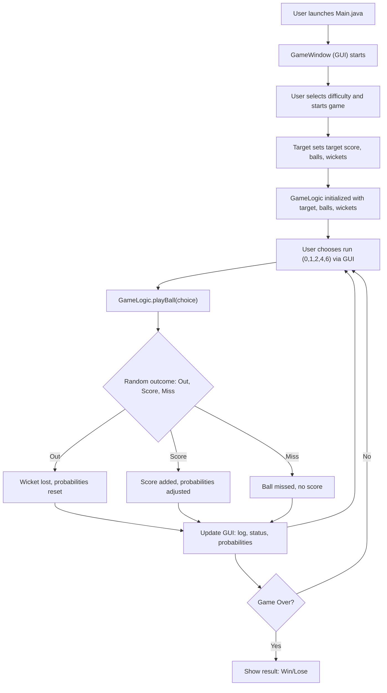

# Probability Cricket Game

## Overview
This project is a Java-based GUI game that simulates a cricket chase scenario using probability. The player must chase a target score within a set number of balls and wickets, making strategic choices for each ball. The game uses probability to determine the outcome of each ball (score, miss, or out), and dynamically adjusts probabilities based on player actions.

## Folder Structure
```
project/
│   Main.java           # Entry point, launches the GUI
│   GameWindow.java     # Main GUI window and user interaction
│   GameLogic.java      # Core game logic and probability engine
│   Batter.java         # Probability presets for batter
│   Target.java         # Sets target score, balls, wickets based on difficulty
│   project.iml         # IntelliJ project file
│   *.class             # Compiled Java classes
│
└───cricket-game/
        README.md       # (Placeholder for submodule or related project)
```

## How to Run
1. Ensure you have Java installed (JDK 8+ recommended).
2. Compile all `.java` files:
   ```sh
   javac *.java
   ```
3. Run the game:
   ```sh
   java Main
   ```

## Gameplay Flow
- Launch the game. The GUI window appears.
- Select a difficulty (Easy, Medium, Hard, or Custom) and start the game.
- The game sets a target score, number of balls, and wickets based on your choice.
- For each ball, choose how many runs to attempt (0, 1, 2, 4, or 6) using the GUI buttons.
- The game uses probability to determine if you score, miss, or get out. Probabilities adjust dynamically based on your choices.
- The game ends when you chase the target, run out of balls, or lose all wickets.

## Game Logic & Probability
- Each run choice (0, 1, 2, 4, 6) and 'out' has an associated probability, initialized from the `Batter` class.
- Probabilities are adjusted after each ball based on the outcome, making the game dynamic and strategic.
- The `GameLogic` class handles all probability calculations and game state updates.

## Flowchart


## Authors & License
- Author: Anuhya Pandey
  

---
For more details, see the code comments in each file. 
